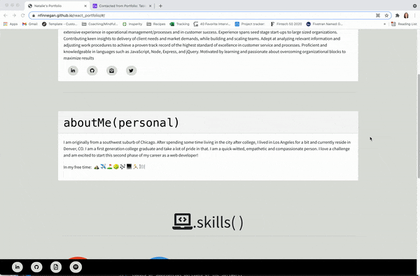

# Professional Portfolio | React

## Description

Keeping my professional portfolio up to date to display and coincide with the technologies I've learned as well as display some of my more recent applications built. This portfolio is strictly front-end and allows a visitor to see my resume, review LinkedIn recommendations I've received from former colleagues ,some of my recent work, as well as a contact me form.

## Resources

- https://stackoverflow.com/questions/48572896/react-how-to-open-pdf-file-as-a-href-target-blank
- https://stackoverflow.com/questions/47196800/reactjs-and-images-in-public-folder
- https://www.youtube.com/playlist?list=PL4cUxeGkcC9gZD-Tvwfod2gaISzfRiP9d

## Technologies Used

- React
- Bootstrap
- Airtable form (embedded)

## Preview

## Deployed Application

Check out the deployed application here:

- https://nfinnegan.github.io/react_portfolio/

## License

Copyright (c) Natalie Finnegan All rights reserved. 

Licensed under the MIT License

Copyright (c) 2021 - present | Natalie Finnegan

<blockquote>
Permission is hereby granted, free of charge, to any person obtaining a copy
of this software and associated documentation files (the "Software"), to deal
in the Software without restriction, including without limitation the rights
to use, copy, modify, merge, publish, distribute, sublicense, and/or sell
copies of the Software, and to permit persons to whom the Software is
furnished to do so, subject to the following conditions:

The above copyright notice and this permission notice shall be included in all
copies or substantial portions of the Software.

THE SOFTWARE IS PROVIDED "AS IS", WITHOUT WARRANTY OF ANY KIND, EXPRESS OR
IMPLIED, INCLUDING BUT NOT LIMITED TO THE WARRANTIES OF MERCHANTABILITY,
FITNESS FOR A PARTICULAR PURPOSE AND NONINFRINGEMENT. IN NO EVENT SHALL THE
AUTHORS OR COPYRIGHT HOLDERS BE LIABLE FOR ANY CLAIM, DAMAGES OR OTHER
LIABILITY, WHETHER IN AN ACTION OF CONTRACT, TORT OR OTHERWISE, ARISING FROM,
OUT OF OR IN CONNECTION WITH THE SOFTWARE OR THE USE OR OTHER DEALINGS IN THE
SOFTWARE.

</blockquote>

